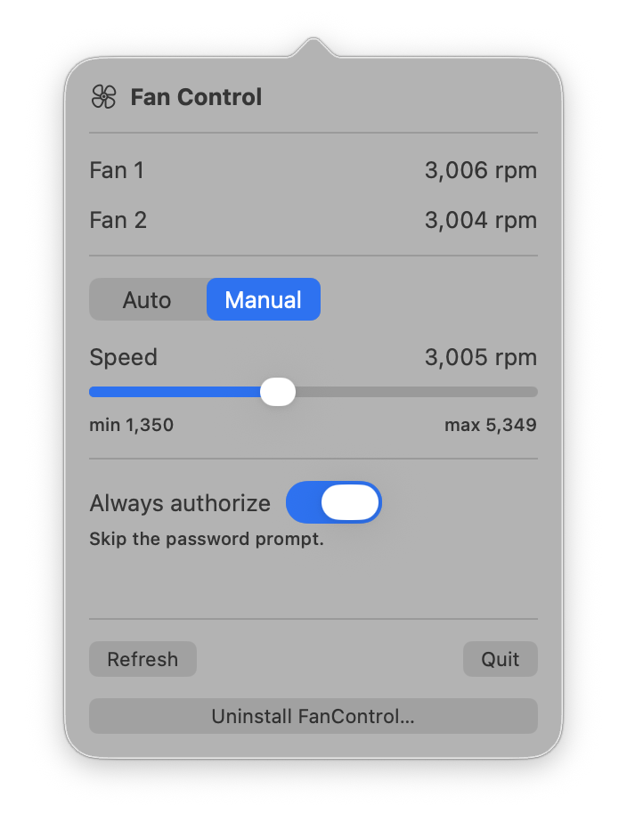

<p align="center">
  
</p>

<h1 align="center">Fan Control</h1>

<p align="center">
  A tiny, dependency-free fan controller for Apple Silicon Macs —
  a menu bar app <em>and</em> a CLI, sharing one SMC core.
</p>

---

Pin your Mac's fans to a fixed speed (or hand them back to macOS) straight from
the menu bar or the terminal. No kernel extensions, no background daemons, no
third-party libraries — just a direct read/write conversation with the **System
Management Controller (SMC)** over IOKit.

> Built and verified on a MacBook Pro (M5 Pro, macOS 26). **Apple Silicon only.**

<p align="center">
  
</p>

## Features

- 📊 **Live RPM readout** for every fan
- 🎚️ **Manual speed** control with a slider, clamped to each fan's safe min/max
- 🔄 **Auto mode** to return control to macOS at any time
- 🖥️ A **menu bar app** (number-only readout) **and** a `fan` **CLI**, on one core
- 🔐 Optional **"Always authorize"** to skip the repeated admin prompt
- 🚀 **Launch at login**, registered automatically on first run
- 🗑️ **One-click uninstall** from inside the app

## How it works

The app talks to the SMC via the `AppleSMC` IOKit user client. Each fan exposes a
set of four-character keys:

| Key        | Meaning                                       |
|------------|-----------------------------------------------|
| `FNum`     | number of fans                                |
| `F{n}Ac`   | current RPM (read)                            |
| `F{n}Mn` / `F{n}Mx` | minimum / maximum RPM                |
| `F{n}Tg`   | target RPM (write to set speed)               |
| `F{n}md`   | mode: `0` = automatic, `1` = forced (manual)  |

Setting a speed writes `F{n}md = 1` then `F{n}Tg = <rpm>`. Returning to auto
writes `F{n}md = 0`. (The code also falls back to the legacy uppercase `F{n}Md` /
`FS!` keys used by older Macs.)

- **Reading** RPMs works as a normal user.
- **Writing** requires **root** — the SMC gates write commands. The app uses the
  standard macOS admin prompt; the CLI uses `sudo`.
- Manual mode **persists until you switch back to auto or reboot** (the SMC resets
  to automatic on boot).
- macOS's thermal manager remains the final safety backstop and will override the
  fans if the machine gets too hot.

## Requirements

- An Apple Silicon Mac **with fans** (MacBook Airs are fanless)
- macOS 13 or later
- Xcode Command Line Tools — `xcode-select --install`

## Build

```sh
git clone https://github.com/SirGian99/mac-fan-control.git
cd mac-fan-control
./build-app.sh
```

This produces:

- `FanControl.app` — the menu bar app
- `.build/release/fan` — the CLI

(For just the binaries: `swift build -c release`.)

## Install the app

```sh
cp -R FanControl.app /Applications/
open /Applications/FanControl.app
```

- The current RPM appears in your **menu bar** (it's a menu-bar app — no dock icon).
- On first launch the app **registers itself as a login item**, so it starts
  automatically at every login.
- The app is **ad-hoc signed**, not notarized. If you copy it to *another* Mac,
  Gatekeeper will block the first launch — right-click the app → **Open**, or run
  `xattr -dr com.apple.quarantine /Applications/FanControl.app`.

## Using the menu bar app

Click the menu bar number to open the panel:

- **Auto / Manual** toggle.
- **Speed** slider (enabled in Manual), bounded by the fans' reported min/max.
- **Always authorize** — opt-in. Turn it on and authenticate once; afterwards,
  speed changes apply with no password prompt (even across reboots). Turning it
  off removes the privileged helper it installed.
- **Refresh**, **Quit**, and **Uninstall FanControl…** (restores auto, removes the
  login item, and moves the app to the Trash).

## Using the CLI

```text
fan [status]              Show fan RPMs and mode          (no root)
fan status --json         Machine-readable status          (no root)
sudo fan set <rpm>        Force ALL fans to <rpm> rpm (manual)
sudo fan set <rpm> -f N   Force only fan N
sudo fan max              Force all fans to their maximum
sudo fan auto             Restore automatic fan control
```

| Command                 | Root? | What it does                                   |
|-------------------------|:-----:|------------------------------------------------|
| `fan` / `fan status`    |  no   | Print each fan's RPM, min/max, target, mode    |
| `fan status --json`     |  no   | Same, as JSON                                  |
| `fan set <rpm>`         |  yes  | Force all fans to `<rpm>` (manual mode)        |
| `fan set <rpm> -f <n>`  |  yes  | Force only fan `<n>`                           |
| `fan max`               |  yes  | Force all fans to their maximum                |
| `fan auto`              |  yes  | Hand control back to macOS                     |

Example:

```sh
$ fan status
Fan 0:  1351 rpm   [min 1350, max 5349]   target 1350   (auto)
Fan 1:  1453 rpm   [min 1350, max 5777]   target 1458   (auto)

$ sudo fan set 3000
Set 2 fan(s) → 3000 rpm (manual)

$ sudo fan auto
Restored automatic fan control
```

Put it on your `PATH` (optional):

```sh
sudo cp .build/release/fan /usr/local/bin/fan
```

## Launch at login

The app registers itself on first launch by writing a per-user LaunchAgent at
`~/Library/LaunchAgents/local.fancontrol.plist`. Helper scripts are included if
you'd rather manage it explicitly:

```sh
./install-login-item.sh     # (re)write and load the LaunchAgent now
./uninstall-login-item.sh   # remove it (leaves the app in place)
```

It also appears under **System Settings → General → Login Items**.

## Permissions & security

Writing fan speed requires root. Two ways to authorize it:

1. **Per-change prompt (default).** Each change shows the standard macOS admin
   dialog. No standing privilege; the prompt *is* the security boundary.
2. **"Always authorize" (opt-in).** Installs a **root-owned** helper at
   `/Library/FanControl/fanctl` plus a `sudoers.d` rule scoped to *only* the fan
   commands. After a single authentication, changes apply with no prompt. The
   directory is root-owned, so the helper can't be swapped by a non-root user
   (no privilege escalation). Trade-off: while enabled, any process running as
   your user can change fan speed without a prompt — the blast radius is limited
   to fan control, nothing else. Fully reversible (toggle off, uninstall, or
   `sudo rm -f /etc/sudoers.d/fancontrol && sudo rm -rf /Library/FanControl`).

## Uninstall

Use the **Uninstall FanControl…** button in the app (restores auto, removes the
login item and any "Always authorize" rule, and moves the app to the Trash), or
manually:

```sh
./uninstall-login-item.sh
rm -rf /Applications/FanControl.app
sudo rm -f /etc/sudoers.d/fancontrol && sudo rm -rf /Library/FanControl   # if you used "Always authorize"
```

## Limitations

- **Apple Silicon only** — built for `arm64`; Intel Macs use a different SMC.
- **Not notarized** — expect a one-time Gatekeeper prompt on other Macs.
- SMC write keys are verified on **M5**; other Apple Silicon generations share the
  same key families and the code falls back gracefully, but writes there are
  unverified.

## License

[MIT](LICENSE)
